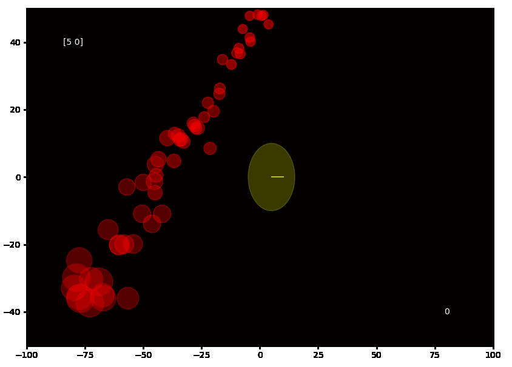
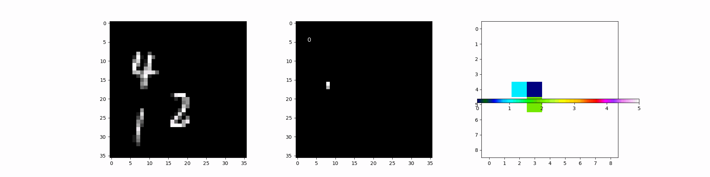

# Minimal Visualized Examples

## Chemical Source Underwater Environment Simulation
  
An example of chemical source underwater environment. In which, the water flows from left to right. The initial concentration of the source is 0.8 out of 1.0. The odor packets are spawned at every time step and traveling under effect of the mean water flow and a sinuous fluctuation. In general, the odor plume has a cone shape.

## Remotely chemical source localizing via timeseries classification

  
  

The underwater simulation (left) and the heat map prediction which tells the source location respect to agent's current location (right).
The autonomous agent has predefined trajectory which repeats going straight to left and right. At each timestep, the agent can sense the chemical concentration whithin its range (yellow circle), and measure the water flow force to infere the chemical source location.
In this episode simulation, based on the strong water flow is from top right to bottom left, the agent can infer the source location is at top of predicting the image. When agents receive some chemical concentration, it can tell the source is at the top right.

## Chemical plume tracking using deep reinforcement learning

  
  

In this episode simulation, based on the strong water flow is from top right to bottom left. The agent is trained to track the chemical plume to seek the chemical source.

## Multi-Agent Object Localization and Classifcation via Reinforcement Learning

  

Multiple MNIST digits are replaced at random position in the environment. Traning a multi-agent reinforcement learning policy to localize and classify all the MNIST digits during exploration.
The first img is the environment example. The middle image is the observations of multi-agents system. The third image is the system's predictions of where and what digits are.

## Image Caption Generating
  

